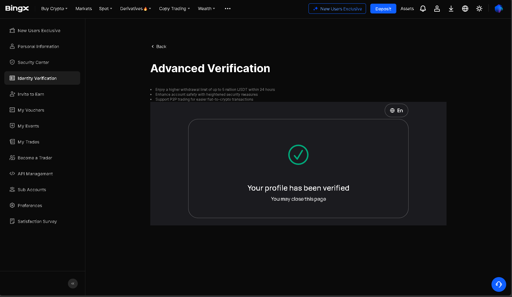
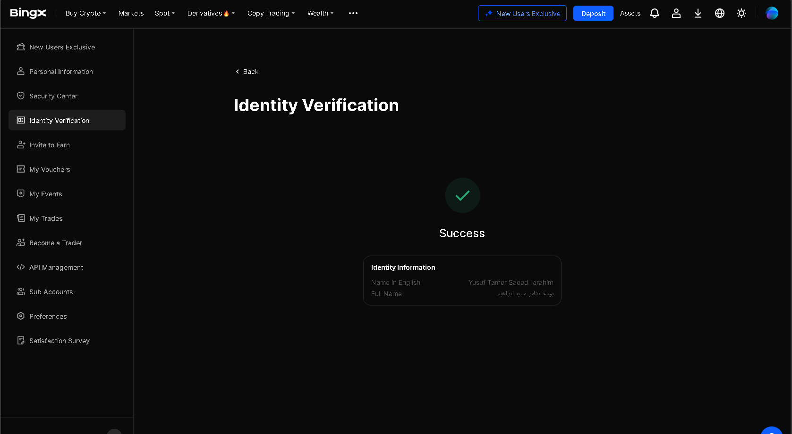

📌 Task 1 — Crypto Exchange Onboarding
Blockchain & Crypto Internship — Future Interns
🚀 Overview

This repository contains my work for Task 1 of the Blockchain & Crypto Internship at Future Interns.
The task focuses on creating an account on a trusted crypto exchange, completing KYC, exploring platform features, and documenting the process.

📝 Task Requirements

Create an account on CoinSwitch Kuber or BingX

Complete KYC verification

Explore key exchange features:

Wallet

Charts

Markets

Trading dashboard

Take screenshots as proof

Publish a LinkedIn post

Submit the repository with documentation

✅ What I Completed
✔️ Chose Exchange: BingX
✔️ Account Creation

Registered using email

Enabled 2FA (optional but recommended)

✔️ KYC Verification

Uploaded ID

Face verification completed

Account successfully verified

✔️ Platform Exploration

Checked wallet balances

Explored market charts

Reviewed trading dashboard

Checked order types (Limit / Market)

Viewed security settings

🧠 Skills Gained

Crypto exchange onboarding

KYC & compliance basics

Understanding trading UI

Market exploration

Documentation & GitHub repo structure

📸 Screenshots

Add your screenshots here (upload them to the repo and link them like this):

👉 My LinkedIn Post

🛠 Tools Used

BingX Exchange

GitHub

Screenshot tools

LinkedIn

📅 Submission Info

Internship: Blockchain & Crypto Internship — Future Interns
Task: Task 1 — Create Your Account on a Trusted Crypto Exchange
Date: 29/11/2025
Name: Yosef Tamer
